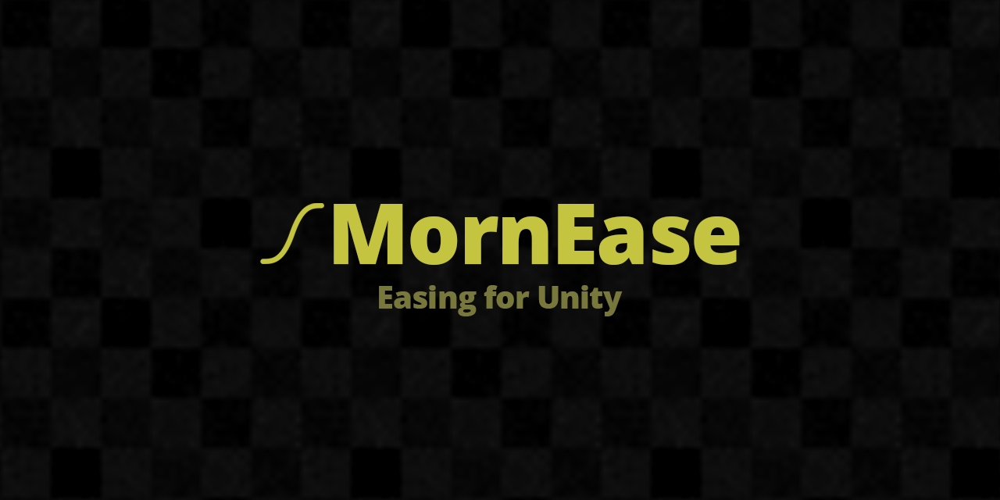

# MornEase

<p align="center">
  
</p>

<p align="center">
  
</p>

## 概要

Unity 向けのイージング関数ライブラリ。`float` の拡張メソッドとして 31 種類の標準イージングカーブを提供します。

## 導入方法

Unity Package Manager で以下の Git URL を追加:

```
https://github.com/TsukumiStudio/MornEase.git?path=src#1.0.0
```

`Window > Package Manager > + > Add package from git URL...` に貼り付けてください。

## 機能

**イージング拡張メソッド**

— `float.Ease(MornEaseType)` で 0〜1 の値を任意のイージングカーブに変換

**提供されるイージングタイプ（31 種類）**

| カテゴリ | タイプ |
|---------|--------|
| 線形 | Linear |
| 三角関数 | EaseInSine / EaseOutSine / EaseInOutSine |
| 多項式 (2乗) | EaseInQuad / EaseOutQuad / EaseInOutQuad |
| 多項式 (3乗) | EaseInCubic / EaseOutCubic / EaseInOutCubic |
| 多項式 (4乗) | EaseInQuart / EaseOutQuart / EaseInOutQuart |
| 多項式 (5乗) | EaseInQuint / EaseOutQuint / EaseInOutQuint |
| 指数 | EaseInExpo / EaseOutExpo / EaseInOutExpo |
| 円形 | EaseInCirc / EaseOutCirc / EaseInOutCirc |
| バック | EaseInBack / EaseOutBack / EaseInOutBack |
| 弾力 | EaseInElastic / EaseOutElastic / EaseInOutElastic |
| バウンス | EaseInBounce / EaseOutBounce / EaseInOutBounce |

## 使い方

```csharp
using MornLib;

var t = 0.5f;
var eased = t.Ease(MornEaseType.EaseInOutCubic);
```

## ライセンス

[The Unlicense](LICENSE)
